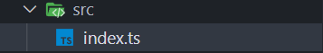
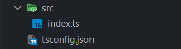
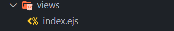
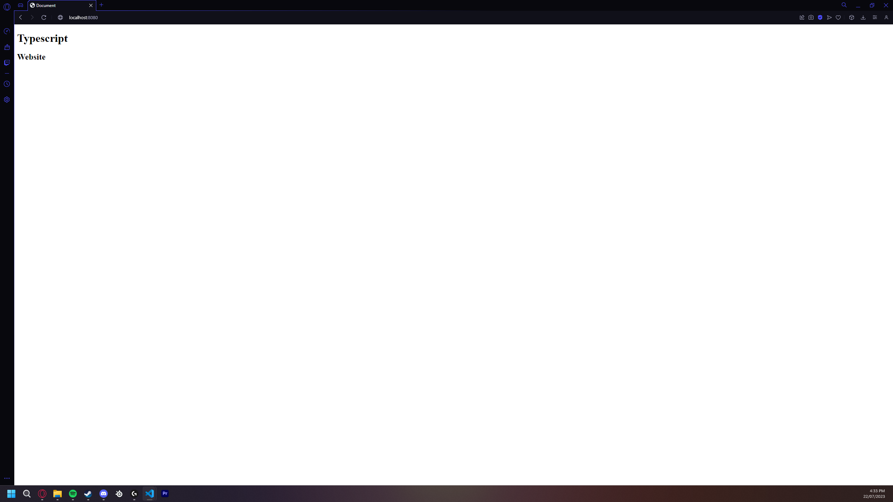

## 1. Create A Source Directory And Place You Entry File In There



## 2. Create A `tsconfig.json` file in the root directory



## 3. Setup The "tsconfig.json"

Add Options Such As `strict`, `rootdir`, `resolveJsonModule` and `outDir`:

```json
{
    "compilerOptions": {
        "strict": true,
        "rootDir": "./src",
        "outDir": "./dist",
        "resolveJsonModule": true
    }
}
```

`strict: true` Forces Good Code Practice

`rootDir: "./src"` Tells The Compiler The Root Directory `root/src`

`outDir: "./dist"` Tells The Compiler The Output Directory `root/dist`

`resolveJsonModule: true` Tells the compiler to allow importing of json files

the distrubution directory or *dist* will contain all compiled javascript code

## 4. Install Packages

At this point you will have to consider what *library* / *language* you want to use.

Most developers use [Next.js](https://nextjs.org) With [React](https://react.dev). It is a very popular library with lots of support however requires more boilerplate compared to using something like [Express](https://expressjs.com).

I will be using Express as it has [EJS](https://ejs.co) support which i really like however i can write a tutorial for any other language if you would like.

For Express run this command in your terminal (ctrl + ~ to open): `npm i express ejs; npm i -D typescript @types/express ts-node`

`npm` means `Node Package Manager`

`i` Is Short For `Install`

All lines after `i` are then the packages to install.

`;` Seperates [Windows Powershell](https://learn.microsoft.com/en-us/powershell/) commands.

`-D` is a flag telling `npm` to install the packages as development dependencies.

## 5. Create Basic Express Server Code

in `root/src/index.ts` you will have to add the code to create the `express` server

```ts
import * as express from 'express'

const app = express()

app.get('/', (req, res) => {
    res.render('index.ejs')
})

app.listen(8080, () => {
    console.log(`Server Running On Port 8080`)
})
```

---

`import * as express from 'express'`:

`import` Start Of Import Statement

`*` Everything in the module

`as` Next word is the name of the module in this file

`express` Name of the package

`from` Next string is the location of the package. defaults to `root/node_modules` or with `./`: `root/`

`'express'` string to location of the package

to me this reads as `import all as express from 'express'`
not too much of a difference from the code

---

`const app = express()`

`const` States that this is a unchanging variable

`app` Name of the variable

`=` Assigning the variable data

`express()` Executing the function

to me this reads as `constant variable: app = return value of express()`

---

```ts 
app.get('/', (req, res) => {
    res.render('index.ejs')
})
```

`app.get` function name

`('/', (req, res) => {` execute function with these values passed

`'/',` the location where you need to go on the website to get to this page

```ts
(req, res) => {
    ...
}
```
This is an arrow function with two variables being given `req` and `res`

`req` request or the data given to the server
`res` response or the data to give to the client

`res.render('index.ejs')` function that gets the page from the views directory and gives to client to `render`

to me all of this code reads as: 
```
    app.get(location: '/', callback function: (requestData, responseData) {
        client.render(pageFileName: 'index.ejs')
    })
```

---

```ts
app.listen(8080, () => {
    console.log(`Server Running On Port 8080`)
})
```

`app.listen(8080, () => { ... })` almost same as before except the port number to listen the website on and another callback when the function is ready

`console.log(...)` Log to the console, pretty simple but very helpful

note: `console.log(...)` will log litteraly anything

## 6. Create Page

Create directory `root/views` and file `index.ejs` under the new directory



## 7. Add Page Code

i wont go into detail with html / ejs code as its much more simple then `Typescript`

pretty much just press `ctrl + space` then `!` and then `enter` and this should apear 
``` html
<!DOCTYPE html>
<html lang="en">
<head>
    <meta charset="UTF-8">
    <meta name="viewport" content="width=device-width, initial-scale=1.0">
    <title>Document</title>
</head>
<body>
    
</body>
</html>
```

now in the body add some testing code e.g.

```html
<body>
    <h1>
        Typescript
    </h1>
    <h2>
        Website
    </h2>
</body>
```

you should have something like this:

```html
<!DOCTYPE html>
<html lang="en">
<head>
    <meta charset="UTF-8">
    <meta name="viewport" content="width=device-width, initial-scale=1.0">
    <title>Document</title>
</head>
<body>
    <h1>
        Typescript
    </h1>
    <h2>
        Website
    </h2>
</body>
</html>
```

## 8. Tell Express How To Work

If you have tried running the code you will have noticed that it errors

this is because we have not told express:
* Where to look for the pages
* How to compile ejs

so we will do that like so:

```ts
app.set('view engine', 'ejs')
app.set('views', path.join(__dirname, '..', 'views'))
```

you can put this under the `const app`
you will also need to import the path module (built into node)
its the same as importing express however instead of `express` its `path`

```ts
import * as path from 'path'
```

---

Code so far:

```ts
import * as express from 'express'
import * as path from 'path'

const app = express()

app.set('view engine', 'ejs')
app.set('views', path.join(__dirname, '..', 'views'))

app.get('/', (req, res) => {
    res.render('index.ejs')
})

app.listen(8080, () => {
    console.log(`Server Running On Port 8080`)
})
```

## 9. Running the current version

In Visual Studio Code click on the blocks on the right side of your screen then search for `TypeScript Debugger` and click the install button

after it installs click on the bug with the triange button and click `create a launch.json file` and select from the menu that apears `TS Debug`

a file called `launch.json` should apear with something simular to this:

```json
{
    // Use IntelliSense to learn about possible attributes.
    // Hover to view descriptions of existing attributes.
    // For more information, visit: https://go.microsoft.com/fwlink/?linkid=830387
    "version": "0.2.0",
    "configurations": [
        {
            "name": "ts-node",
            "type": "node",
            "request": "launch",
            "args": [
                "${relativeFile}"
            ],
            "runtimeArgs": [
                "-r",
                "ts-node/register"
            ],
            "cwd": "${workspaceRoot}",
            "protocol": "inspector",
            "internalConsoleOptions": "openOnSessionStart"
        }
    ]
}
```

replace `"${relativeFile}"` with `"src/index"`

now press `F5` and the debug console should open with this message

```
C:\Program Files\nodejs\node.exe -r ts-node/register src/index
Server Running On Port 8080
```

then open your web browser of choice and navigate to: `localhost:8080` and



## 10. Add More Pages And Such

Now we can add more pages like an admin dashboard and such

index.ejs:
```html
<!DOCTYPE html>
<html lang="en">

<head>
    <meta charset="UTF-8">
    <meta name="viewport" content="width=device-width, initial-scale=1.0">
    <title>Document</title>
</head>

<body>
    <h1>
        Typescript
    </h1>
    <h2>
        Website
    </h2>
    <a href="/admin">
        To Admin
    </a>
</body>

</html>
```

---

admin.ejs:
```html
<!DOCTYPE html>
<html lang="en">

<head>
    <meta charset="UTF-8">
    <meta name="viewport" content="width=device-width, initial-scale=1.0">
    <title>Document</title>
</head>

<body>
    <h1>
        Admin
    </h1>
</body>

</html>
```

---

index.ts:
```ts
import * as express from 'express'
import * as path from 'path'

const app = express()

app.set('view engine', 'ejs')
app.set('views', path.join(__dirname, '..', 'views'))

app.get('/', (req, res) => {
    res.render('index.ejs')
})

app.get('/admin', (req, res) => {
    res.render('admin.ejs')
})

app.listen(8080, () => {
    console.log(`Server Running On Port 8080`)
})
```

## Notes And Such

Mentioning that there is a module that allows people to login with their discord called `passport-discord` i believe

there is also ways to verify without `passport` however they require more code